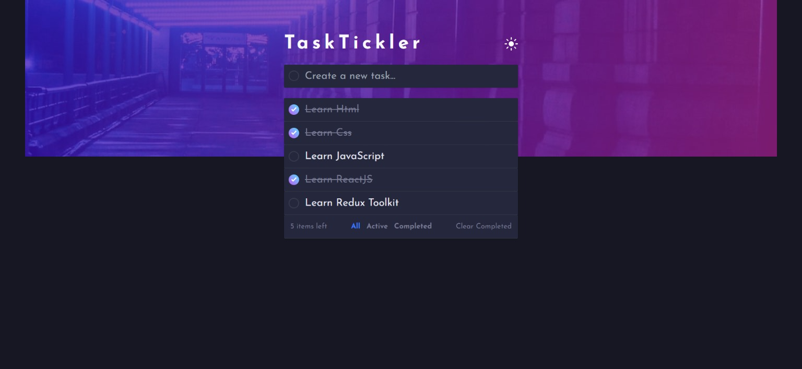

# TaskTickler - Task Management App

Welcome to TaskTickler, a React application built with Vite. This task management app uses Redux Toolkit for state management, Tailwind CSS for styling, and React Hot Toast for notifications.

## Introduction

TaskTickler is designed to help you efficiently organize and track your tasks. It provides a clean and intuitive interface for managing your to-do lists, with state management powered by Redux Toolkit for a seamless user experience.

## Features

- **Task Creation and Deletion:** Easily add new tasks and remove completed ones.
- **Redux Toolkit:** Efficient state management for a responsive and dynamic UI.
- **Tailwind CSS:** Utilize the power of Tailwind CSS for a modern and stylish design.
- **React Hot Toast:** Real-time notifications for task updates and actions.

## Getting Started

Follow these steps to get TaskTickler up and running on your local machine:

1. Clone the repository: `git clone https://github.com/KamalJoshi-web/tasktickler.git`
2. Navigate to the project directory: `cd tasktickler`
3. Install dependencies: `npm install`
4. Start the development server: `npm run dev`

## Project Structure

The project structure is organized as follows:

- `src/`: Contains the source code of the TaskTickler app.
  - `components/`: React components used throughout the app.
  - `features/`: Redux Toolkit slices and logic for state management.
  - `styles/`: Stylesheets, with Tailwind CSS styling.
  - `utils/`: Utility functions and helpers.
- `public/`: Static assets and HTML template.

## Dependencies

The key dependencies used in TaskTickler include:

- React
- Vite
- Redux Toolkit
- Tailwind CSS
- React Hot Toast

For a complete list of dependencies, refer to the `package.json` file.
